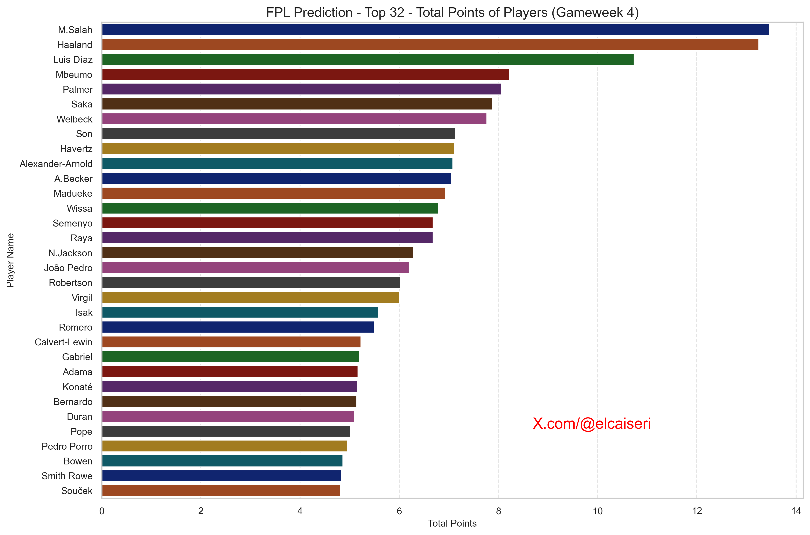

# FantasyLTX

Introducing **Fantasy-Premier-League-LTX** (Linear Tree Expert) – a predictive tool for Fantasy Premier League (FPL) that leverages linear and tree-based models to optimize your FPL team! This project combines historical data, match information, and advanced models to predict player performances and help you build the best team possible.

## Table of Contents
- [Project Overview](#project-overview)
- [Project Structure](#project-structure)
- [Installation](#installation)
- [Configuration](#configuration)
- [Usage](#usage)
  - [Finding Top Players](#finding-top-players)
  - [Finding the Best Team](#finding-the-best-team)
  - [Running Both Features](#running-both-features)
- [Model Version and Last Date Trained](#model-version-and-last-date-trained)
- [Scripts Explanation](#scripts-explanation)
- [Contributing](#contributing)
- [License](#license)

## Project Overview

The FPL Prediction Project uses historical player performance data, combined with match data fetched from an external API, to predict player points for upcoming gameweeks. The predictions are made using a combination of Linear Regression and XGBoost models, allowing users to make data-driven decisions for their FPL teams.

## Project Structure

```
fpl-prediction-project/
│
├── config/                   # Configuration files
│   └── config.yaml           # Configuration for model parameters, paths, etc.
│
├── data/                     # Data storage
│   ├── external/             # External data from APIs or other sources
│   │   └── fpl-data-stats2025.csv
│   ├── processed/            # Cleaned and processed data files
│   └── raw/                  # Raw data files
│
├── models/                   # Trained models storage
│   ├── processor.pkl
│   ├── linear_regression.pkl
│   └── xgboost_model.pkl
│
├── notebooks/                # Jupyter Notebooks for exploratory analysis
│   └── fpl_analysis.ipynb
│
├── src/                      # Source code for the project
│   ├── __init__.py           # Makes src a package
│   ├── data_preparation.py   # Scripts for data cleaning and preprocessing
│   ├── feature_engineering.py # Scripts for feature engineering
│   ├── inference.py          # Scripts for making predictions
│   ├── utils.py              # Utility functions
│   ├── team_selection.py     # Scripts for selecting the optimal FPL team
│   ├── find_top_players.py   # Script to find top players based on predictions
│   └── find_best_team.py     # Script to find the best team within budget
│
├── main.py                   # Main script to run the prediction process
├── requirements.txt          # List of dependencies
└── .gitignore                # Git ignore file to exclude unnecessary files
```

## Installation

1. **Clone the repository**:
   ```bash
   git clone https://github.com/elcaiseri/fpl-prediction.git
   cd fpl-prediction
   ```

2. **Create a virtual environment**:
   ```bash
   python -m venv venv
   source venv/bin/activate  # On Windows use `venv\Scripts\activate`
   ```

3. **Install dependencies**:
   ```bash
   pip install -r requirements.txt
   ```

## Configuration

Before running the project, ensure that the configuration file `config/config.yaml` is correctly set up. Key configuration options include:

- **API Configuration**: Set the `url` and `api_key` for fetching match data.
- **Model Paths**: Define paths to saved models and pipelines.
- **Columns Configuration**: Specify the categorical, numerical, and target columns.

## Usage

### Finding Top Players

1. **Download the latest player data**:
   Go to [FPL Statistics](https://www.fpl-data.co.uk/statistics), scroll down to the bottom of the page, and click the "Download CSV" button to download the updated player data. Save the CSV file in the `data/external/` directory with the name `fpl-data-stats2025.csv`.

2. **Run the main script to find top players**:
   ```bash
   python main.py --data_path data/external/fpl-data-stats2025.csv --run_top_players
   ```




### Finding the Best Team

1. **Run the main script to find the best team**:
   ```bash
   python main.py --data_path data/external/fpl-data-stats2025.csv --budget 100.5 --auto_select_bench --run_best_team
   ```

| element_type | web_name   | team_name      | opponent_team_name | was_home | gameweek | now_cost | total_points | points_square_per_million |
|--------------|------------|----------------|--------------------|----------|----------|----------|--------------|---------------------------|
| goalkeepers  | Fabianski  | West Ham       | Fulham             | False    | 4        | 4.0      | 0.116304     | 0.003382                   |
| goalkeepers  | A.Becker   | Liverpool      | Nottingham Forest  | True     | 4        | 5.5      | 7.055220     | 9.050204                   |
| defenders    | Keane      | Everton        | Aston Villa        | False    | 4        | 4.0      | 1.846797     | 0.852664                   |
| defenders    | Romero     | Tottenham      | Arsenal            | True     | 4        | 5.1      | 5.495184     | 5.920990                   |
| defenders    | Gabriel    | Arsenal        | Tottenham          | False    | 4        | 6.0      | 5.204891     | 4.515148                   |
| defenders    | Pedro Porro| Tottenham      | Arsenal            | True     | 4        | 5.5      | 4.951616     | 4.457909                   |
| defenders    | Robinson   | Fulham         | West Ham           | True     | 4        | 4.6      | 4.498729     | 4.399688                   |
| midfielders  | M.França   | Crystal Palace | Leicester          | True     | 4        | 4.4      | -0.000319    | 0.0000000231               |
| midfielders  | Luis Díaz  | Liverpool      | Nottingham Forest  | True     | 4        | 7.6      | 10.733676    | 15.159450                  |
| midfielders  | M.Salah    | Liverpool      | Nottingham Forest  | True     | 4        | 12.7     | 13.468941    | 14.284440                  |
| midfielders  | Mbeumo     | Brentford      | Manchester City    | False    | 4        | 7.1      | 8.220697     | 9.518291                   |
| midfielders  | Semenyo    | Bournemouth    | Chelsea            | True     | 4        | 5.6      | 6.681000     | 7.970673                   |
| forwards     | Jebbison   | Bournemouth    | Chelsea            | True     | 4        | 4.5      | 0.121055     | 0.003257                   |
| forwards     | Haaland    | Manchester City| Brentford          | True     | 4        | 15.2     | 13.249590    | 11.549450                  |
| forwards     | Welbeck    | Brighton       | Ipswich            | True     | 4        | 5.7      | 7.765669     | 10.579930                  |


### Running Both Features

1. **Run both top player prediction and best team selection**:
   ```bash
   python main.py --data_path data/external/fpl-data-stats2025.csv --budget 100.5 --auto_select_bench --run_top_players --run_best_team
   ```

### Explanation of Command-Line Arguments
- `--data_path`: Path to the CSV file containing the latest player data. Default is `data/external/fpl-data-stats2025.csv`.
- `--budget`: Specifies the total budget available for selecting the best team. Default is `100.0`.
- `--auto_select_bench`: If used, automatically selects the cheapest players as bench players to optimize the main team selection.
- `--run_top_players`: Executes the top players' prediction based on the latest data and trained models.
- `--run_best_team`: Executes the best team selection within the specified budget constraints.

### Example Commands
- **Find top players only**:
  ```bash
  python main.py --run_top_players
  ```
- **Find the best team within budget**:
  ```bash
  python main.py --budget 102 --run_best_team
  ```
- **Find both top players and the best team**:
  ```bash
  python main.py --run_top_players --run_best_team
  ```

## Model Version and Last Date Trained

| Model                  | Version | Last Trained       | Changes                                     | Current |
|------------------------|---------|--------------------|---------------------------------------------|---------|
| Linear Regression      | v1.0    | September 5, 2024  | Initial training with historical data.      | ✅       |
| XGBoost                | v1.0    | September 5, 2024  | Initial training with historical data.      | ✅       |
| Preprocessing Pipeline | v1.0    | September 5, 2024  | Initial setup and data processing pipeline. | ✅       |

- **Model**: The name of the model or pipeline.
- **Version**: Indicates the current version of the model in use.
- **Last Trained**: The date when the model or pipeline was last trained or updated.
- **Changes**: Summary of the changes or updates made during the training.
- **Current**: A checkmark (✅) indicates the most recent and currently used version.

## Scripts Explanation

- **`src/inference.py`**: Contains functions to merge data, prepare data for the next gameweek, and perform predictions using the trained models.
- **`src/find_top_players.py`**: Finds the top players based on predicted performance for the upcoming gameweek.
- **`src/find_best_team.py`**: Selects the best team within a specified budget based on predicted player performance.
- **`main.py`**: The entry point of the project, handling configuration loading, model loading, and calling the necessary functions to run predictions and team selection.
- **`src/utils.py`**: Utility functions for loading data, models, and configurations, as well as fetching match data from the API.
- **`src/data_preparation.py`**: Functions for cleaning and transforming data.

## What is next?

  - Enhance the Team Selection Algorithm: Refine algorithms for improved accuracy and efficiency.
  - Develop a Simple UI: Create a user-friendly interface for non-developers.
  - Improve Documentation: Help us by enhancing the project documentation.
  - Fix Bugs: Report or resolve any bugs or issues you encounter.

## Contributing

Contributions are welcome! If you have suggestions or improvements, please fork the repository, create a new branch, and submit a pull request.

## License

This project is licensed under the MIT License - see the [LICENSE](LICENSE) file for details.
